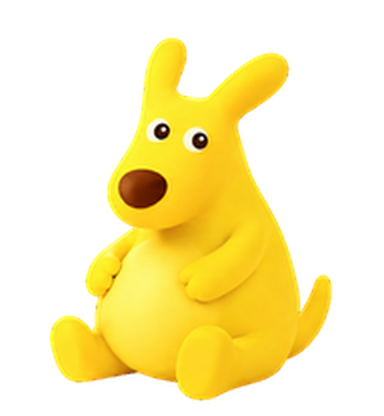

# 肥嘟嘟 · 美团袋鼠 Codex 桌宠

根据“你的胆子真是肥嘟嘟的”视频与原头像制作的非官方桌宠。



## 安装

```sh
git clone https://github.com/inoader/codex-feidudu-pet.git
cd codex-feidudu-pet
python3 install.py
```

重新打开 Codex，在桌宠选择器中选择 **肥嘟嘟 · 美团袋鼠**。

已有旧版本时运行 `python3 install.py --replace`。脚本只复制桌宠文件，不修改全局设置。
手动安装：将 `pet.json` 与 `spritesheet.webp` 放入 `$CODEX_HOME/pets/meituan-feidudu/`（默认 `~/.codex/pets/meituan-feidudu/`）。

## 本次修正

根据实际截图，待机比跳跃结束帧大约7%，且偏亮黄；现将六帧待机及中性帧按同一比例缩小，并以跳跃结束帧校正黄色。保留原眨眼、呼吸和脚底锚点。对比见[尺寸与颜色](qa/idle-comparison.png)。


- 鼻子去掉凸起边圈，脸型拉宽、肚子加圆，短手与向前坐姿脚更接近参考。
- 逐行动作制作：左右跑动步态交替；同一只短爪挥手；小幅跳跃保留上下位移。
- 工作改为算手指/思考，检查改为托腮观察，等待为伸掌示意。
- 修复相邻尾巴混入、脚被裁断、状态切换突然缩小和未使用格不透明。
- 升级 v2，增加 16 个顺时针视线方向；脚、肚子和尾根保持位置，头与眼睛转向。

视频中的原型主要为坐姿配字幕，桌宠动作是据此设计的衍生动画，并非原视频逐帧复制。

## 规格与检查

`1536 × 2288`，8列11行，每格192×208，透明 WebP，`spriteVersionNumber: 2`。

9行基础动作依次为 idle、running-right、running-left、waving、jumping、failed、waiting、running、review。
最后两行是从向上开始，按22.5°递增的16向视线。未使用格保持透明。

四个主方向通过三位独立检查者的盲测；部分斜向的轻微分量较含蓄，左上回正步幅略不均匀，已作为视觉检查警告记录。

[完整动作与视线检查图](qa/contact-sheet.png) · [视线检查图](qa/look-directions.png)

## 重新构建

安装成品只需要 Python 标准库。重新构建还需 Pillow，以及本机安装的 `hatch-pet` skill：

```sh
python3 -m venv .venv
. .venv/bin/activate
pip install -r requirements.txt
python3 build_pet.py --skill-dir ~/.codex/skills/hatch-pet
```

`source/rows/` 保存已选定的整行动作原图；构建脚本调用 hatch-pet 的提帧、对齐、合成和边缘清理工具，再调用 `normalize_idle.py` 统一待机尺寸和色调。更换原图后仍需重新视觉审查，脚本通过不代表动作和形象必然正确。

生成使用内置 imagegen；提示词见 `source/prompts/`，视频观察记录见 [video-reference-review.md](source/video-reference-review.md)。

## 参考

- [坐姿肥嘟嘟视频](https://www.douyin.com/video/7674898507736147129)
- [站姿辅助参考](https://www.douyin.com/video/7674706022082277745)
- [原头像与全身形象](https://www.sina.cn/news/detail/5334329758319460.html)

美团及其袋鼠形象相关权利归原权利人所有。本项目与美团或 OpenAI 无隶属关系。
